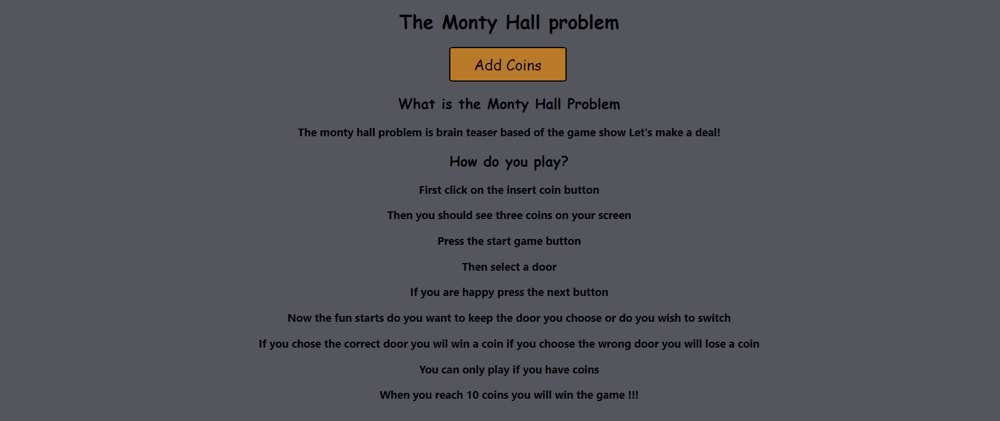
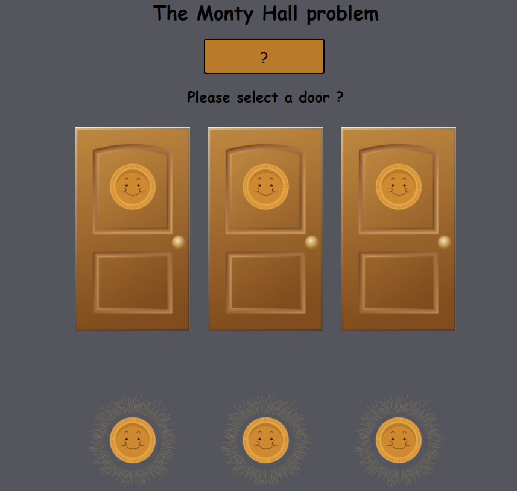
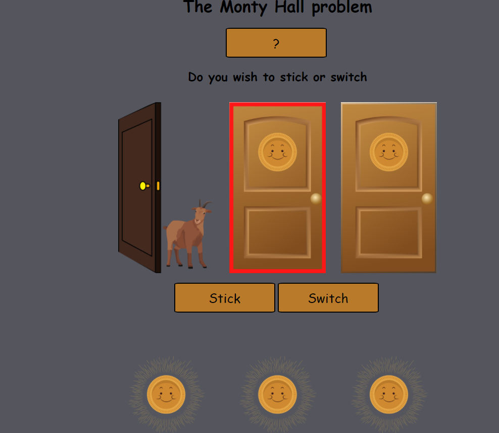

# The Monty Hall problem 

### What is the Monty Hall Problem?
##### The monty hall problem is brainteaser based of the game show Let's make a deal!
### How to install ?
#### This is a React.js app, so you need node.js and then just npm install it and npm start to start the app
### How do you play?
#### First click on the insert coin button.
#### Then you should see three coins on your screen.
#### Press the start game button.
#### Then select a door.
#### If you are happy press the next button.
#### Now the fun starts do you want to keep the door you choose or do you wish to switch.
#### If you chose the correct door you wil win a coin if you choose the wrong door you will lose a coin.
#### You can only play if you have coins.
#### When you reach 10 coins you will win the game !!!
## Some images 

